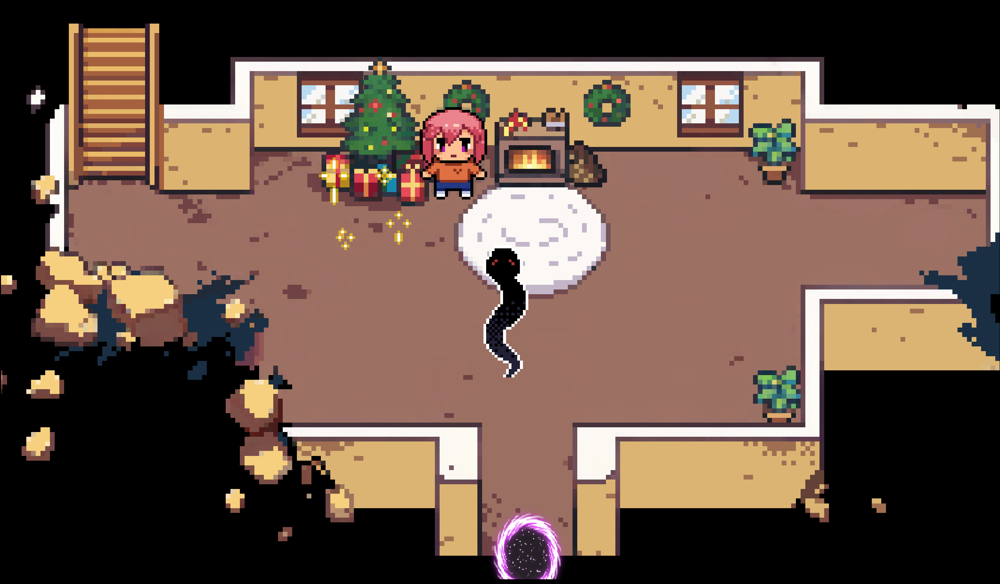

  <h1>The Snake's Shadow | 蛇影之下</h1>

## Links | 目录
1. [Download | 下载 ](#download)
2. [How To Start | 如何开始](#how-to-start)
3. [About The Game | 游戏介绍](#about-the-game)
4. [Screenshots | 游戏截图](#screenshots)

---

  <h1 id="download">Download | 下载</h1>

###  Current Version | 最新版本 
[ V0.2.2](https://github.com/baozishark/The-Snake-s-Shadow/releases/tag/v0.2.2)  
### Previous Version | 历史版本  
[ V0.1.0_DEMO](https://github.com/baozishark/The-Snake-s-Shadow/releases/tag/demo) 

---

  <h1 id="how-to-start">How To Start | 如何开始</h1>

1. **Download `_The.Snake.s.Shadow.rar` | 下载文件**  
2. **Unzip | 解压文件**  
3. **Double Click "蛇影之下_The Snake's Shadow.exe" To Start | 双击 "蛇影之下_The Snake's Shadow.exe"启动游戏**  
4. **Choose Language (English/Chinese) | 选择语言**

---

  <h1 id="about-the-game">About The Game | 游戏介绍</h1>

**AVG fan game inspired by *Degrees of Lewdity* | 受到《Degrees of Lewdity》启发的AVG粉丝游戏**  

- **The Snake's Shadow—— A story back in Bailey and Eden's school days, when three best friends lived in a small town steeped in danger. 
Their innocence was taken. Soon, they'd be the town's most powerful villains.** 

- **《蛇影之下》——  贝利和伊甸校园时代发生的故事，三位挚友生活在一座危机四伏的小镇上。
少女们的纯真被夺走。不久后，她们将成为镇上最强大的反派。**
  

### Language Options | 语言选择
- **English / 中文**

---

  <h1 id="screenshots">Screenshots | 游戏截图</h1>

#### v0.2.2

**Pixel art CG gallery! Starting from the orphanage main hall, exploring maps, collecting CGs, unlock all Bailey's memory points. A mysterious NPC is waiting for you…**

**像素风格CG画廊！从孤儿院大厅出发，探索地图，收集CG，解锁贝利的所有回忆点。一个神秘的NPC正等待您......**
  

#### v0.1.0 DEMO
**Eden with Bailey | 伊甸和贝利**  
  

**Expressions | 表情**  
  

**Orphanage Hallway | 孤儿院走廊**  
  

**Main characters: Eden, Bailey and Bailey's crush | 主要角色：伊甸，贝利，贝利的暗恋对象**  
  

**Orphan's Bedroom | 孤儿卧室**  
  

**Former orphanage director / 前孤儿院长**  
  

---
