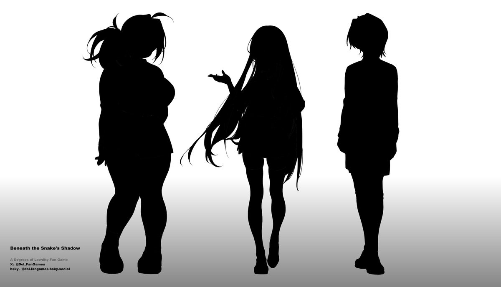
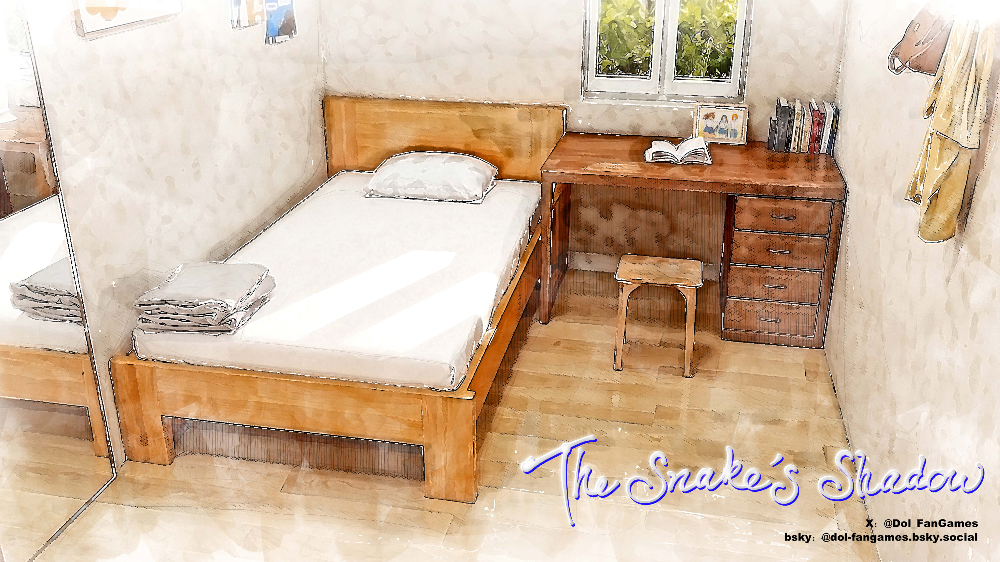

  <h1>The Snake's Shadow DEMO | 蛇影之下 DEMO</h1>

---

  <h1>How To Start | 如何开始游戏</h1>

1. **Download `_The.Snake.s.Shadow_DEMO.rar` | 下载文件**  
2. **Unzip the file | 解压文件**  
3. **Double-click `蛇影之下_The Snake's Shadow_DEMO.exe` | 双击启动游戏**  
4. **Choose Language (English/Chinese) | 选择语言**

---

  <h1>About The Game | 游戏介绍</h1>

**AVG fan game based on *Degrees of Lewdity* | 基于《Degrees of Lewdity》的AVG粉丝游戏**  

**The Snake's Shadow** —— A story set in Bailey and Eden's school days, where three best friends navigate a dangerous small town.  
**少女们的纯真被夺走，最终成为小镇最强大的反派**  
  

### 语言选择
- **English / 中文**
 
### 目前版本
- **0.1.0 DEMO**

---

  <h1>Screenshots | 游戏截图</h1>

#### v0.1.0 DEMO
**Eden with Bailey | 伊甸和贝利**  
  

**Expressions | 表情**  
  

**Orphanage Hallway | 孤儿院走廊**  
  

**Main characters: Eden, Bailey and Bailey's crush | 主要角色：伊甸，贝利，贝利的暗恋对象**  
  

**Orphan's Bedroom | 孤儿卧室**  
  

**Former orphanage director / 前孤儿院长**  
  

---
